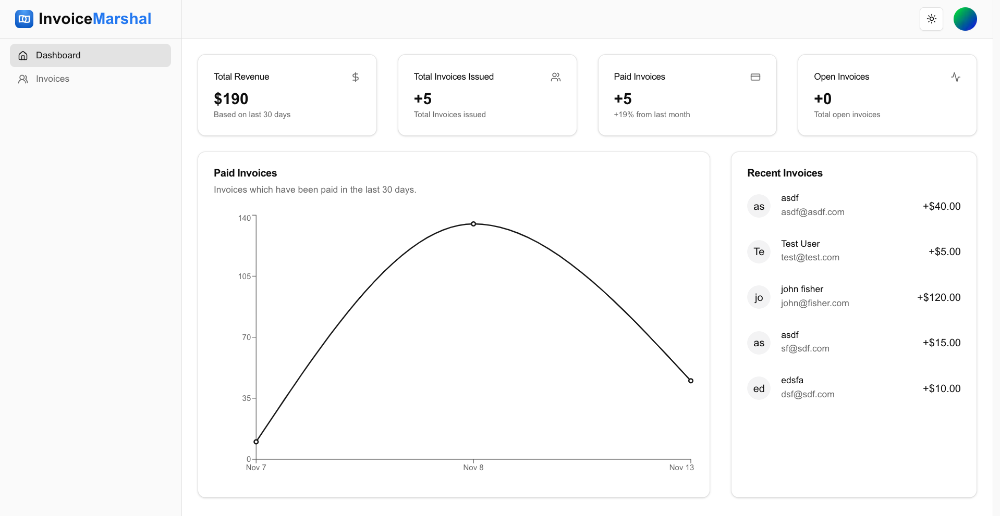

# Done & Paid

A modern invoice management system built with Next.js 14, helping you spend more time fixing things and less time figuring out invoices.



## Features

- 🔐 **Advanced Authentication**

  - Email/Password authentication
  - OAuth support (Google, GitHub)
  - Two-factor authentication (2FA)
  - Email verification
  - Password reset functionality

- 👥 **Role-Based Access Control**

  - User roles (Admin, User)
  - Protected routes
  - Role-specific content rendering

- 💻 **Modern Dashboard**

  - Responsive layout
  - Dark/Light theme support
  - Command palette (⌘K)
  - Breadcrumb navigation
  - Collapsible sidebar

- 🛠️ **Technical Features**
  - Server and client components
  - API route handlers
  - Database integration
  - Form validation
  - Error handling
  - Toast notifications
  - PWA support

## Tech Stack

- **Framework**: Next.js 14
- **Authentication**: NextAuth.js v5
- **Database**: PostgreSQL + Prisma ORM
- **Styling**: Tailwind CSS + shadcn/ui
- **Email Service**: Resend
- **Form Handling**: React Hook Form + Zod
- **State Management**: React Context
- **Command Palette**: kbar

## Prerequisites

- Node.js 18+
- PostgreSQL
- npm/pnpm
- Git

<!--
## Environment Variables

Create a `.env` file in the root directory with the following variables:

```js
DATABASE_URL=

AUTH_SECRET=

GITHUB_CLIENT_ID=
GITHUB_CLIENT_SECRET=

GOOGLE_CLIENT_ID=
GOOGLE_CLIENT_SECRET=

RESEND_API_KEY=

NEXT_PUBLIC_APP_URL=
```

## Installation

1. Clone the repository

2. Install dependencies:

```shell
pnpm install
```

3. Set up the database:

```shell
npx prisma generate
npx prisma db push
```

4. Start the development server:

```shell
pnpm run dev
``` -->

## Available Commands

| Command       | Description               |
| ------------- | ------------------------- |
| `dev`         | Starts development server |
| `build`       | Creates production build  |
| `start`       | Starts production server  |
| `lint`        | Runs linter               |
| `postinstall` | Generates Prisma client   |

## Project Structure

```
├── app/                  # App router pages
├── components/           # Reusable components
├── hooks/               # Custom React hooks
├── lib/                 # Utility functions
├── prisma/              # Database schema and migrations
└── public/              # Static assets
```

## Contributing

Contributions are welcome! Please feel free to submit a Pull Request.

## License

This project is licensed under the MIT License - see the [LICENSE](LICENSE) file for details.

## Acknowledgments

- [Next.js](https://nextjs.org/)
- [NextAuth.js](https://next-auth.js.org/)
- [Shadcn UI](https://ui.shadcn.com/)
- [Prisma](https://www.prisma.io/)
